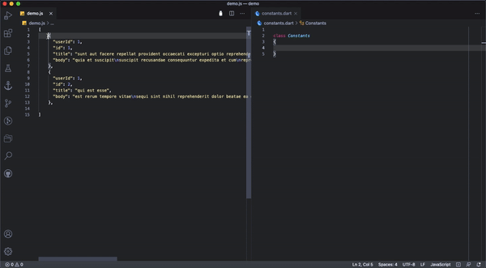

## Json to Field Constants

This Extension convert the json object keys to constants. 
These constant are very usefull while working with api and saving responses to databases.
Example Mobile apps (Flutter,Java,Reat Native)

